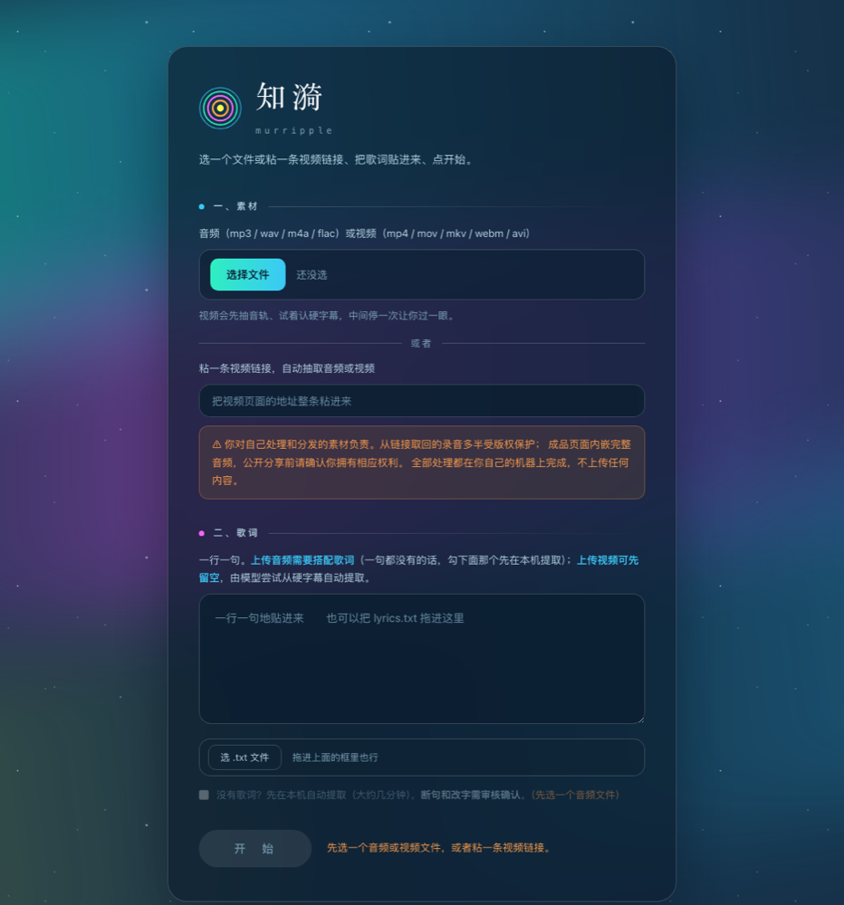
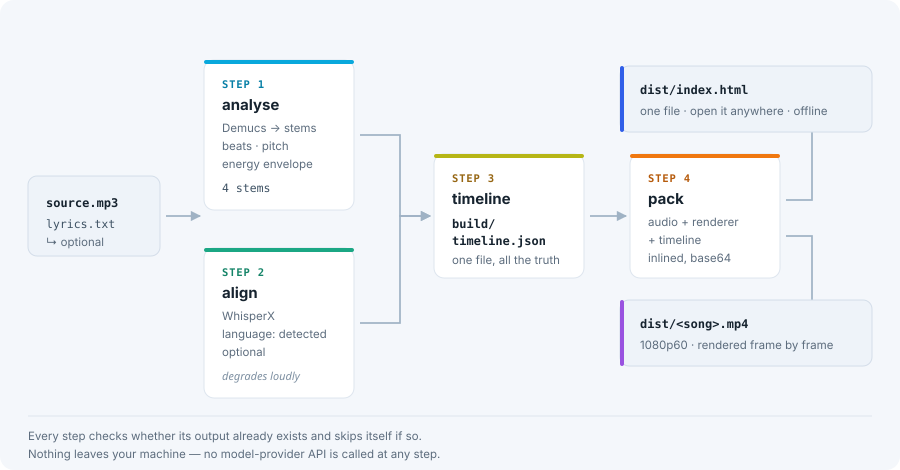

# murRipple (Français)

Tisser une chanson en ondulations visibles.

Donnez à murRipple un fichier audio et ses paroles ; il vous rend un
**`index.html` autonome, en un seul fichier** — double-cliquez pour l'ouvrir,
envoyez-le à un ami, déposez-le sur GitHub Pages — ainsi qu'une **vidéo MP4 en
1080p60**.

[English](README.md) · [中文](README.zh-CN.md) · **Français**

<p align="center">
  
  <br><sub>Voilà toute l'interface. Elle tourne sur votre machine et n'écoute que sur l'interface de bouclage. Ce qu'elle produit est <a href="https://ymustc.github.io/murripple-demo/">écoutable en ligne</a> — c'est la chanson d'exemple livrée avec ce dépôt.</sub>
</p>

## La chaîne, en quatre étapes

<p align="center">
  
</p>

Le schéma ci-dessus se lit de gauche à droite : **analyse** (séparation des pistes
avec Demucs, puis tempo, hauteur et énergie) → **alignement** (WhisperX cale les
paroles sur le temps ; optionnel, et toute dégradation est signalée explicitement) →
**timeline** (`build/timeline.json`, un seul fichier qui contient toute la vérité) →
**assemblage** (audio, moteur de rendu et timeline sont tous intégrés au fichier).
Deux sorties : `dist/index.html` et `dist/<chanson>.mp4`. **Chaque étape vérifie
d'abord si son résultat existe déjà et passe son tour le cas échéant.**

## Tout tourne sur votre machine

- **Aucune API de grand modèle de langage. Aucune clé d'API. Aucune inscription.**
  Ce projet n'appelle aucun fournisseur de modèle, nulle part.
- **L'analyse audio est locale.** La séparation des sources (Demucs), l'analyse du
  tempo et de la hauteur (librosa) et l'alignement des paroles (WhisperX,
  optionnel) s'exécutent sur votre propre processeur. Votre audio n'est jamais
  téléversé.
- **Le fichier produit n'émet aucune requête réseau.** `dist/index.html` intègre
  l'audio, la timeline et le moteur de rendu ; ouvrez-le sans connexion, il
  fonctionne quand même.
- La chaîne d'outils ne touche au réseau qu'à deux endroits, tous deux optionnels
  et déclenchés par vous : les modèles téléchargent leurs poids à la première
  exécution, et `murripple ingest --url <lien>` va délibérément chercher la vidéo
  que vous lui avez indiquée.

> ⚠ **Vous êtes responsable du matériel que vous traitez et distribuez.** Les
> enregistrements récupérés depuis un lien sont le plus souvent protégés par le
> droit d'auteur ; un fichier produit par murRipple contient l'audio complet.
> Assurez-vous de détenir les droits avant tout partage public. Tout le traitement
> se fait sur votre machine — rien n'est téléversé.

## Prérequis

- **Python 3.11** — figé, et non simplement recommandé : Demucs ne fonctionne pas
  sur Python 3.13. Le projet isole donc un environnement 3.11 via
  [uv](https://docs.astral.sh/uv/).
- **ffmpeg** — `brew install ffmpeg` (ou le gestionnaire de paquets de votre système).
- **Node.js** — uniquement pour construire le bundle du moteur de rendu ou exporter
  la vidéo.

## Installation

```bash
uv sync --group dev
uv sync --group dev --extra align   # alignement des paroles (WhisperX), optionnel
uv sync --group dev --extra ocr     # lire les sous-titres incrustés, optionnel
```

Sans `align`, la chaîne fonctionne quand même : elle se replie sur « pas de couche
de paroles » et le dit clairement.

## Lancer la chanson d'exemple

Ce dépôt contient une chanson complète, pour que vous puissiez fabriquer quelque
chose de réel avant même de chercher votre propre matériel.
**[*Trempe-moi*](songs/05-trempe-moi/) est une chanson de l'auteur lui-même** :
musique générée avec Suno, paroles écrites par lui, droits lui appartenant.

```bash
uv run murripple run songs/05-trempe-moi
open songs/05-trempe-moi/dist/index.html

cd renderer && npm install
node video/render.mjs ../songs/05-trempe-moi --size 1920x1080
```

## Faire la vôtre

```bash
mkdir -p songs/ma-chanson
cp /chemin/vers/chanson.mp3 songs/ma-chanson/source.mp3
$EDITOR songs/ma-chanson/lyrics.txt   # une ligne par ligne de sous-titre

uv run murripple run songs/ma-chanson
```

`run` enchaîne analyse puis assemblage, et chaque étape se saute si son résultat
existe déjà. Utilisez `--force` pour tout refaire.

### …ou depuis un navigateur

```bash
uv run murripple serve
```


Le serveur local n'écoute **que sur l'interface de bouclage** : aucune autre
machine du réseau ne peut l'atteindre. Choisissez un fichier, collez les paroles,
lancez. Donnez-lui une vidéo plutôt qu'un fichier audio et il en extrait la piste
son, tente de lire les sous-titres incrustés, puis **s'arrête** et vous rend le
résultat à corriger avant de continuer.

## Ce que dessine le moteur de rendu

Un anneau de jugement piloté par la voix principale ; des notes qui tombent avec
des traînées de comète ; des étincelles à l'impact ; des paroles qui arrivent comme
des cœurs de lumière ; un spectre radial ; un fond de nébuleuse ; des ondes à
chaque mesure ; un anneau gradué ; une barre de lecture ; un panneau des voix où
chaque piste peut être isolée ou coupée ; et un carton-titre.

« Ce que vous voyez dans le navigateur est ce qui se trouve dans le MP4 exporté »
n'est pas un slogan : tout le rendu est une fonction déterministe de `t`, et un
test rend deux fois le même instant puis compare les empreintes des images
(`renderer/test/export-determinism.test.mjs`).

## Tests

```bash
uv run pytest -q            # Python
cd renderer && npm test     # moteur de rendu
```

## Ce qui ne s'y trouve pas

Le sous-système paramétrique **compose** — celui qui, au lieu d'un fichier audio,
prend une graine aléatoire et écrit lui-même un morceau instrumental — ne fait pas
partie de ce dépôt.

## Licence

**[PolyForm Noncommercial License 1.0.0](LICENSE)** — `Copyright (c) 2026 YU Miao`.

> **Ce n'est pas une licence open source.** Elle ne satisfait pas la définition de
> l'Open Source Initiative, car elle restreint le domaine d'utilisation. Merci de
> ne pas décrire murRipple comme « open source » ; « source disponible, usage non
> commercial » est exact.

- **Vous pouvez** utiliser, étudier, modifier et partager murRipple, et
  construire par-dessus, pour tout usage **non commercial** : projets personnels,
  recherche, enseignement, associations, institutions publiques.
- **Vous ne pouvez pas** en faire un usage commercial : ni le vendre, ni l'intégrer
  à un produit ou service payant, ni l'utiliser dans le cadre d'une activité
  professionnelle.
- **Vous souhaitez un usage commercial ?** Demandez. La licence ne l'accorde
  simplement pas par défaut ; c'est une conversation, pas un refus.

Le texte intégral de `LICENSE` fait foi. Les trois points ci-dessus n'en sont qu'un
résumé en langage courant, sans effet juridique propre.
